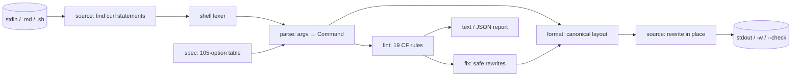

# curlfmt

[English](README.md) | [中文](README.zh.md) | [日本語](README.ja.md)

[](LICENSE) [](go.mod) [](CHANGELOG.md)  [](CONTRIBUTING.md)

**curlfmt：ドキュメント・スクリプト・CI で朽ちていく curl コマンドを正規化する、オープンソースかつ依存ゼロのフォーマッタ兼リンタ —— 世界で最もコピペされるコマンドのための gofmt。**


```bash
git clone https://github.com/JaydenCJ/curlfmt && cd curlfmt
go build -o curlfmt ./cmd/curlfmt    # single static binary, stdlib only
```

> プレリリース：v0.1.0 はまだどのパッケージレジストリにも公開されていません。上記の手順でソースからビルドしてください（Go ≥1.22 なら可）。

## なぜ curlfmt か？

どの README、運用手順書、API ドキュメントにも curl コマンドが溜まり、いつも同じ形で朽ちていきます：誰もレビューできない 240 文字の 1 行コマンド、書いた本人にしか読めない `-sSLXPOST` の短縮フラグ連結、クォートされていない `?a=1&b=2` がコマンドを密かにバックグラウンド化してクエリの半分を捨てる罠、オンコール担当者が最も必要としたエラーメッセージを `-s` が飲み込む問題、そして URL に直接貼られたパスワード。既存ツールでは解決しません：[curlconverter](https://github.com/curlconverter/curlconverter) は curl を Python や JavaScript へ*翻訳して手放す*ツールで、curl のままであるべきドキュメントには使えません。shfmt はシェル構文しか整形せず、curl の 200 以上のオプションを不透明な単語としか見ないため、並べ替えも展開も lint もできません。手書きの正規表現チェックは最初のクォート付き JSON ボディで壊れます。curlfmt は curl を *curl のまま*にして gofmt の扱いを与えます：本物のシェル字句解析器、105 オプションの仕様表、唯一の正規レイアウト（長いオプション名、1 行 1 オプション、method → auth → headers → body → output → URL）、CF コード付きの 19 の lint ルールと安全な自動修正、そして Markdown やスクリプト内の curl 文だけを書き換え、それ以外のバイトには一切触れない書き換え機能です。

| | curlfmt | curlconverter | shfmt | CI の正規表現 |
|---|---|---|---|---|
| 出力が curl コマンドのまま | ✅ | ❌ 他言語へ翻訳 | ✅ | ✅ |
| curl オプションを理解（引数の有無、別名、連結フラグ） | ✅ 105 オプションの表 | ✅ | ❌ 不透明な単語 | ❌ |
| 正規かつ冪等なレイアウト | ✅ | n/a | ✅ シェル層のみ | ❌ |
| curl 特有の罠を lint（`-k`、`-S` なしの `-s`、クォートなしの `&`） | ✅ 19 のコード付きルール | ❌ | ❌ | 脆弱 |
| Markdown フェンス内の書き換え | ✅ | ❌ | ❌ | ❌ |
| `$VAR` / `$(…)` をそのまま保持 | ✅ | 部分的 | ✅ | ❌ |
| ランタイム依存 | 0 | Node + 依存 | 0 | n/a |

<sub>依存数は 2026-07-13 に確認：curlfmt は Go 標準ライブラリのみを import。curlconverter（npm）はランタイムパッケージ 5 個と tree-sitter 文法を取得します。</sub>

## 特長

- **唯一の正規形** —— 長いオプション名、ソート済みブールフラグ、1 行 1 オプション、決定的なグループ順、URL は最後。`format(format(x)) == format(x)` をテストで固定。
- **正規表現ではなく本物のシェル字句解析器** —— 単一/二重引用符、エスケープ、バックスラッシュ継続、複数行 JSON ボディ、コメント、末尾のパイプライン（`| jq .`）まで正しく往復。
- **変数は無傷のまま** —— `$VAR`、`${…}`、`$(…)`、バッククォートを含む語は引用符ごと原文どおりに出力。curlfmt は生きたシェル構文を避けて整形し、決して踏み抜きません。
- **根拠付きの 19 の lint ルール** —— 安定した CF コードで定番の問題を捕捉：`--insecure`、URL 内の資格情報、平文 `http://`、エラーを隠す `--silent`、CI での `--fail` 欠如、重複ヘッダ、クエリを切断するクォートなしの `&`。
- **安全な自動修正** —— `--fix` は意味を変えないと証明できる書き換えのみ適用（冗長な `-X GET`/`-X POST` の削除、`--silent` への `--show-error` 追加、完全一致の重複ヘッダ統合、`--opt=value` の分割）。
- **docs-as-code ネイティブ** —— Markdown フェンス（```` ``` ````/`~~~`、`$ ` プロンプト、インデントされたフェンス）とシェルスクリプト（コメントと heredoc はスキップ）内の curl 文を書き換え。文の外のバイトはすべて保持。
- **依存ゼロ・完全オフライン** —— Go 標準ライブラリのみ。curlfmt は curl を実行せず、ソケットも開かず、どこにも何も送信しません。

## クイックスタート

```bash
echo "curl -sSLX POST http://127.0.0.1:8080/v1/items -H 'content-type:application/json' \
  -H 'accept: application/json' -u admin:hunter2 -d '{\"name\":\"demo\",\"qty\":2}' -o resp.json" | ./curlfmt
```

実際にキャプチャした出力：

```text
curl --location --show-error --silent \
  --request POST \
  --user admin:hunter2 \
  --header 'Content-Type: application/json' \
  --header 'Accept: application/json' \
  --data '{"name":"demo","qty":2}' \
  --output resp.json \
  http://127.0.0.1:8080/v1/items
```

どこが*おかしい*かを尋ねる（`curlfmt lint`、実際の出力、終了コード 1）：

```text
<stdin>:1: CF002 warning: --request POST is implied by the data option; drop it
<stdin>:1: CF007 info: without --fail or --fail-with-body, HTTP 4xx/5xx still exit 0 (dangerous in CI)
<stdin>:1: CF012 info: --user carries an inline password; prefer a .netrc file or omit the password to be prompted
```

CI でドキュメントをゲートし、その場で修正：

```bash
./curlfmt --check docs/ README.md    # exit 1 + list of files needing formatting
./curlfmt -w --fix docs/ README.md   # rewrite in place, applying safe lint fixes
```

## Lint ルール

設計メモ付きの全表は [docs/lint-rules.md](docs/lint-rules.md) を参照。`lint` は warning か error が 1 つでもあれば終了コード 1。`info` は助言のみ。`--format json` は安定した機械可読レポートを出力します。

| コード | 重大度 | 検出内容 |
|---|---|---|
| CF001/CF002 | warning · fix | 冗長な明示的 `--request GET`/`POST` |
| CF003 | warning | `--insecure` が TLS 検証を無効化 |
| CF004 | error | URL に資格情報が埋め込まれている |
| CF005 | warning | ループバック以外への平文 `http://` |
| CF006 | warning · fix | `--show-error` なしの `--silent` |
| CF007 | info | `--fail` 欠如：CI でも HTTP エラーが終了コード 0 |
| CF008 | warning · fix | 重複するヘッダフィールド |
| CF009 | error | クォートなしの `&` がクエリ文字列でコマンドを分断 |
| CF010–CF019 | 混在 | body/method の矛盾、未知オプション、`--json` とヘッダの衝突、後勝ちオプションの重複、`--opt=value`、値の欠落など |

## CLI リファレンス

`curlfmt [fmt|lint|version] [flags] [path ...]` —— 既定は `fmt`。パスを省略すると stdin を読みます。パスは `.md`/`.sh` ファイルか走査対象ディレクトリ。終了コード：0 正常、1 検出あり/整形が必要、2 使い方エラー、3 I/O エラー。

| フラグ | 既定値 | 効果 |
|---|---|---|
| `-w`, `--write` | off | 出力せずファイルをその場で書き換える |
| `-l`, `--list` | off | 変更が生じるファイル名だけを表示 |
| `--check` | off | `--list` と同様だが、変更があれば終了コード 1 |
| `--fix` | off | 整形と同時に安全な lint 修正も適用 |
| `--width N` | `80` | コマンドを 1 行に保つ最大長 |
| `--format F`（lint） | `text` | lint の出力形式：`text` か `json` |

## 検証

このリポジトリに CI はありません。上記の主張はすべてローカル実行で検証しています：

```bash
go test ./...            # 91 deterministic tests, offline, < 5 s
bash scripts/smoke.sh    # end-to-end CLI check, prints SMOKE OK
```

## アーキテクチャ



## ロードマップ

- [x] v0.1.0 —— シェル字句解析器、105 オプションの仕様表、正規フォーマッタ、安全な修正付き 19 lint ルール、Markdown/スクリプト書き換え、gofmt 流 CLI、91 テスト + smoke スクリプト
- [ ] `--check` の `--diff` 出力（ファイル名ではなく unified diff）
- [ ] JSON コンテントタイプの `--data` に対するオプトインの JSON 整形
- [ ] 環境変数プレフィックス（`TOKEN=x curl …`）と `docker exec`/`ssh` ラップ呼び出しへの対応
- [ ] ルール重大度の設定とファイル単位の除外（`# curlfmt:ignore`）
- [ ] 出力の Windows `cmd`/PowerShell クォート方言

全リストは [open issues](https://github.com/JaydenCJ/curlfmt/issues) を参照。

## コントリビュート

Issue・ディスカッション・PR を歓迎します —— ローカルの作業手順（format、vet、テスト、`SMOKE OK`）は [CONTRIBUTING.md](CONTRIBUTING.md) を参照。入門タスクには [good first issue](https://github.com/JaydenCJ/curlfmt/issues?q=is%3Aissue+is%3Aopen+label%3A%22good+first+issue%22) のラベルが付き、設計の議論は [Discussions](https://github.com/JaydenCJ/curlfmt/discussions) で行っています。

## ライセンス

[MIT](LICENSE)
