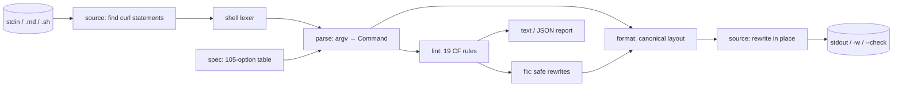

# curlfmt

[English](README.md) | [中文](README.zh.md) | [日本語](README.ja.md)

[](LICENSE) [](go.mod) [](CHANGELOG.md)  [](CONTRIBUTING.md)

**curlfmt：an open-source, zero-dependency formatter and linter that canonicalizes the curl commands rotting in your docs, scripts, and CI — gofmt for the world's most-pasted command.**


```bash
git clone https://github.com/JaydenCJ/curlfmt && cd curlfmt
go build -o curlfmt ./cmd/curlfmt    # single static binary, stdlib only
```

> Pre-release: v0.1.0 is not tagged on a package registry yet; build from source as above (any Go ≥1.22).

## Why curlfmt?

Every README, runbook, and API doc accumulates curl commands, and they rot in the same ways: a 240-character one-liner nobody can review, `-sSLXPOST` clusters only the author could parse, an unquoted `?a=1&b=2` that silently backgrounds the command and drops half the query string, `-s` swallowing the very error message the on-call engineer needed, and a password pasted straight into the URL. The existing tools don't help: [curlconverter](https://github.com/curlconverter/curlconverter) translates *away* from curl into Python or JavaScript — great until the doc is supposed to stay a curl command; shfmt formats shell syntax but sees curl's 200+ options as opaque words, so it can neither order, expand, nor lint them; and hand-rolled regex checks break on the first quoted JSON body. curlfmt keeps curl *as curl* and gives it the gofmt treatment: a real shell lexer, a 105-option spec table, one canonical layout (long flags, one option per line, method → auth → headers → body → output → URL), 19 CF-coded lint rules with safe auto-fixes, and rewriting that touches curl statements inside Markdown and scripts while leaving every other byte alone.

| | curlfmt | curlconverter | shfmt | regex in CI |
|---|---|---|---|---|
| Output stays a curl command | ✅ | ❌ translates to other languages | ✅ | ✅ |
| Understands curl options (arity, aliases, clusters) | ✅ 105-option table | ✅ | ❌ opaque words | ❌ |
| Canonical, idempotent layout | ✅ | n/a | ✅ shell-level only | ❌ |
| Lints curl-specific traps (`-k`, `-s` w/o `-S`, unquoted `&`) | ✅ 19 coded rules | ❌ | ❌ | fragile |
| Rewrites inside Markdown fences | ✅ | ❌ | ❌ | ❌ |
| Preserves `$VAR` / `$(…)` verbatim | ✅ | partially | ✅ | ❌ |
| Runtime dependencies | 0 | Node + deps | 0 | n/a |

<sub>Dependency counts checked 2026-07-13: curlfmt imports the Go standard library only; curlconverter (npm) pulls 5 runtime packages plus a tree-sitter grammar.</sub>

## Features

- **One canonical form** — long option names, sorted boolean flags, one option per continuation line, deterministic grouping, URLs last; `format(format(x)) == format(x)` is pinned by tests.
- **A real shell lexer, not a regex** — single/double quotes, escapes, backslash continuations, multi-line JSON bodies, comments, and trailing pipelines (`| jq .`) all round-trip correctly.
- **Your variables survive** — words containing `$VAR`, `${…}`, `$(…)`, or backticks are re-emitted verbatim, quoting included; curlfmt formats around live shell, never through it.
- **19 lint rules with receipts** — stable CF codes for the classics: `--insecure`, credentials in URLs, plain `http://`, `--silent` hiding errors, missing `--fail` in CI, duplicate headers, the unquoted-`&` query-string killer.
- **Safe auto-fixes** — `--fix` applies only provably semantics-preserving rewrites (drop redundant `-X GET`/`-X POST`, pair `--silent` with `--show-error`, collapse identical duplicate headers, split `--opt=value`).
- **Docs-as-code native** — rewrites curl statements inside Markdown fences (```` ``` ````/`~~~`, `$ ` prompts, indented fences) and shell scripts (skipping comments and heredocs); every byte outside a statement is preserved.
- **Zero dependencies, fully offline** — Go standard library only; curlfmt never executes curl, never opens a socket, sends nothing anywhere.

## Quickstart

```bash
echo "curl -sSLX POST http://127.0.0.1:8080/v1/items -H 'content-type:application/json' \
  -H 'accept: application/json' -u admin:hunter2 -d '{\"name\":\"demo\",\"qty\":2}' -o resp.json" | ./curlfmt
```

Real captured output:

```text
curl --location --show-error --silent \
  --request POST \
  --user admin:hunter2 \
  --header 'Content-Type: application/json' \
  --header 'Accept: application/json' \
  --data '{"name":"demo","qty":2}' \
  --output resp.json \
  http://127.0.0.1:8080/v1/items
```

Ask what's *wrong* with it (`curlfmt lint`, real output, exit code 1):

```text
<stdin>:1: CF002 warning: --request POST is implied by the data option; drop it
<stdin>:1: CF007 info: without --fail or --fail-with-body, HTTP 4xx/5xx still exit 0 (dangerous in CI)
<stdin>:1: CF012 info: --user carries an inline password; prefer a .netrc file or omit the password to be prompted
```

Gate your docs in CI, then fix them in place:

```bash
./curlfmt --check docs/ README.md    # exit 1 + list of files needing formatting
./curlfmt -w --fix docs/ README.md   # rewrite in place, applying safe lint fixes
```

## Lint rules

Full table with design notes in [docs/lint-rules.md](docs/lint-rules.md). `lint` exits 1 on any warning or error; `info` is advice only. `--format json` emits a stable machine-readable report.

| Code | Severity | Finding |
|---|---|---|
| CF001/CF002 | warning · fix | redundant explicit `--request GET`/`POST` |
| CF003 | warning | `--insecure` disables TLS verification |
| CF004 | error | credentials embedded in the URL |
| CF005 | warning | plain-text `http://` to a non-loopback host |
| CF006 | warning · fix | `--silent` without `--show-error` |
| CF007 | info | no `--fail`: HTTP errors exit 0 in CI |
| CF008 | warning · fix | duplicate header field |
| CF009 | error | unquoted `&` splits the command at the query string |
| CF010–CF019 | mixed | body/method conflicts, unknown options, `--json` header clashes, repeated last-one-wins options, `--opt=value`, missing values, … |

## CLI reference

`curlfmt [fmt|lint|version] [flags] [path ...]` — `fmt` is the default; no path means stdin. Paths may be `.md`/`.sh` files or directories to walk. Exit codes: 0 ok, 1 findings/would reformat, 2 usage error, 3 I/O error.

| Flag | Default | Effect |
|---|---|---|
| `-w`, `--write` | off | rewrite files in place instead of printing |
| `-l`, `--list` | off | print only the names of files that would change |
| `--check` | off | like `--list`, but exit 1 when anything would change |
| `--fix` | off | also apply safe lint fixes while formatting |
| `--width N` | `80` | longest a command may be and still stay on one line |
| `--format F` (lint) | `text` | lint output: `text` or `json` |

## Verification

This repository ships no CI; every claim above is verified by local runs:

```bash
go test ./...            # 91 deterministic tests, offline, < 5 s
bash scripts/smoke.sh    # end-to-end CLI check, prints SMOKE OK
```

## Architecture



## Roadmap

- [x] v0.1.0 — shell lexer, 105-option spec table, canonical formatter, 19 lint rules with safe fixes, Markdown/script rewriting, gofmt-style CLI, 91 tests + smoke script
- [ ] `--diff` output for `--check` (unified diff instead of file names)
- [ ] Opt-in JSON body pretty-printing for `--data` with JSON content types
- [ ] Env-prefix support (`TOKEN=x curl …`) and `docker exec`/`ssh`-wrapped invocations
- [ ] Configurable rule severities and per-file ignores (`# curlfmt:ignore`)
- [ ] Windows `cmd`/PowerShell quoting dialect for output

See the [open issues](https://github.com/JaydenCJ/curlfmt/issues) for the full list.

## Contributing

Issues, discussions and pull requests are welcome — see [CONTRIBUTING.md](CONTRIBUTING.md) for the local workflow (format, vet, tests, `SMOKE OK`). Good entry points are labelled [good first issue](https://github.com/JaydenCJ/curlfmt/issues?q=is%3Aissue+is%3Aopen+label%3A%22good+first+issue%22), and design questions live in [Discussions](https://github.com/JaydenCJ/curlfmt/discussions).

## License

[MIT](LICENSE)
