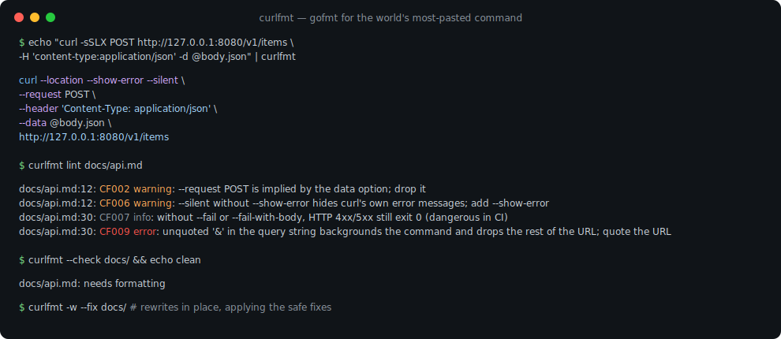
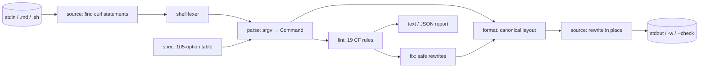

# curlfmt

[English](README.md) | [中文](README.zh.md) | [日本語](README.ja.md)

[](LICENSE) [](go.mod) [](CHANGELOG.md)  [](CONTRIBUTING.md)

**curlfmt：开源、零依赖的 curl 命令格式化与 lint 工具，把文档、脚本和 CI 里腐烂的 curl 命令规范化 —— 给这条全世界被粘贴最多的命令一个 gofmt。**



```bash
git clone https://github.com/JaydenCJ/curlfmt && cd curlfmt
go build -o curlfmt ./cmd/curlfmt    # single static binary, stdlib only
```

> 预发布：v0.1.0 尚未发布到任何包仓库；请按上面的方式从源码构建（任意 Go ≥1.22）。

## 为什么选 curlfmt？

每个 README、运维手册和 API 文档都在积累 curl 命令，而它们总以同样的方式腐烂：一条 240 个字符、没人能 review 的单行命令；只有原作者才看得懂的 `-sSLXPOST` 组合短参数；一个未加引号的 `?a=1&b=2`，悄悄把命令挂到后台并丢掉一半查询串；`-s` 吞掉了值班工程师最需要的那条报错；还有直接贴进 URL 的密码。现有工具帮不上忙：[curlconverter](https://github.com/curlconverter/curlconverter) 是把 curl *翻译成* Python 或 JavaScript —— 但很多文档就该保持 curl；shfmt 只格式化 shell 语法，把 curl 的 200 多个选项当成不透明单词，既不能排序、展开，也不能 lint；手写的正则检查则会在第一个带引号的 JSON body 上崩掉。curlfmt 让 curl *继续是 curl*，并给它 gofmt 待遇：真正的 shell 词法分析器、105 个选项的规格表、唯一的规范布局（长选项名、每行一个选项、method → auth → headers → body → output → URL）、19 条带 CF 编号的 lint 规则与安全自动修复，以及只改写 Markdown 与脚本中 curl 语句、其余字节一概不动的重写能力。

| | curlfmt | curlconverter | shfmt | CI 里的正则 |
|---|---|---|---|---|
| 输出仍然是 curl 命令 | ✅ | ❌ 翻译成其他语言 | ✅ | ✅ |
| 理解 curl 选项（取值、别名、组合短参数） | ✅ 105 个选项的表 | ✅ | ❌ 不透明单词 | ❌ |
| 规范且幂等的布局 | ✅ | n/a | ✅ 仅 shell 层面 | ❌ |
| 检查 curl 特有陷阱（`-k`、缺 `-S` 的 `-s`、未引号的 `&`） | ✅ 19 条编号规则 | ❌ | ❌ | 脆弱 |
| 在 Markdown 代码块内改写 | ✅ | ❌ | ❌ | ❌ |
| 原样保留 `$VAR` / `$(…)` | ✅ | 部分 | ✅ | ❌ |
| 运行时依赖 | 0 | Node + 依赖 | 0 | n/a |

<sub>依赖数量核对于 2026-07-13：curlfmt 只 import Go 标准库；curlconverter（npm）拉取 5 个运行时包外加一个 tree-sitter 语法。</sub>

## 特性

- **唯一规范形式** —— 长选项名、排序后的布尔开关、每行一个选项、确定性分组、URL 放最后；`format(format(x)) == format(x)` 由测试钉死。
- **真正的 shell 词法分析器，不是正则** —— 单双引号、转义、反斜杠续行、多行 JSON body、注释以及尾随管道（`| jq .`）全都能正确往返。
- **你的变量安然无恙** —— 含 `$VAR`、`${…}`、`$(…)` 或反引号的词按原文（连同引号）原样输出；curlfmt 绕着活的 shell 语法格式化，绝不穿透它。
- **19 条有据可查的 lint 规则** —— 稳定的 CF 编号覆盖经典问题：`--insecure`、URL 里的凭证、明文 `http://`、`--silent` 吞错、CI 里缺 `--fail`、重复 header、未加引号的 `&` 截断查询串。
- **安全的自动修复** —— `--fix` 只应用可证明不改语义的重写（删掉冗余的 `-X GET`/`-X POST`、给 `--silent` 配上 `--show-error`、合并完全相同的重复 header、拆开 `--opt=value`）。
- **为 docs-as-code 而生** —— 改写 Markdown 代码块（```` ``` ````/`~~~`、`$ ` 提示符、缩进的代码围栏）和 shell 脚本（跳过注释与 heredoc）中的 curl 语句；语句之外的每个字节都原样保留。
- **零依赖、完全离线** —— 只用 Go 标准库；curlfmt 从不执行 curl、从不打开 socket、不向任何地方发送任何东西。

## 快速上手

```bash
echo "curl -sSLX POST http://127.0.0.1:8080/v1/items -H 'content-type:application/json' \
  -H 'accept: application/json' -u admin:hunter2 -d '{\"name\":\"demo\",\"qty\":2}' -o resp.json" | ./curlfmt
```

真实捕获的输出：

```text
curl --location --show-error --silent \
  --request POST \
  --user admin:hunter2 \
  --header 'Content-Type: application/json' \
  --header 'Accept: application/json' \
  --data '{"name":"demo","qty":2}' \
  --output resp.json \
  http://127.0.0.1:8080/v1/items
```

问问它哪里*不对*（`curlfmt lint`，真实输出，退出码 1）：

```text
<stdin>:1: CF002 warning: --request POST is implied by the data option; drop it
<stdin>:1: CF007 info: without --fail or --fail-with-body, HTTP 4xx/5xx still exit 0 (dangerous in CI)
<stdin>:1: CF012 info: --user carries an inline password; prefer a .netrc file or omit the password to be prompted
```

在 CI 里给文档设门禁，然后就地修复：

```bash
./curlfmt --check docs/ README.md    # exit 1 + list of files needing formatting
./curlfmt -w --fix docs/ README.md   # rewrite in place, applying safe lint fixes
```

## Lint 规则

完整表格与设计说明见 [docs/lint-rules.md](docs/lint-rules.md)。`lint` 在出现任何 warning 或 error 时退出 1；`info` 仅是建议。`--format json` 输出稳定的机器可读报告。

| 编号 | 严重级 | 发现的问题 |
|---|---|---|
| CF001/CF002 | warning · fix | 冗余的显式 `--request GET`/`POST` |
| CF003 | warning | `--insecure` 关闭了 TLS 校验 |
| CF004 | error | URL 中内嵌了凭证 |
| CF005 | warning | 对非回环主机使用明文 `http://` |
| CF006 | warning · fix | `--silent` 却没有 `--show-error` |
| CF007 | info | 缺 `--fail`：CI 里 HTTP 错误照样退出 0 |
| CF008 | warning · fix | 重复的 header 字段 |
| CF009 | error | 未加引号的 `&` 在查询串处截断命令 |
| CF010–CF019 | 混合 | body/method 冲突、未知选项、`--json` 与 header 冲突、重复的"后者生效"选项、`--opt=value`、缺失取值等 |

## CLI 参考

`curlfmt [fmt|lint|version] [flags] [path ...]` —— `fmt` 为默认；不给路径则读 stdin。路径可以是 `.md`/`.sh` 文件或待遍历的目录。退出码：0 正常，1 有发现/需要重排，2 用法错误，3 I/O 错误。

| 参数 | 默认值 | 效果 |
|---|---|---|
| `-w`, `--write` | 关 | 就地改写文件而不是打印 |
| `-l`, `--list` | 关 | 只打印会发生变化的文件名 |
| `--check` | 关 | 同 `--list`，但只要有变化就退出 1 |
| `--fix` | 关 | 格式化的同时应用安全的 lint 修复 |
| `--width N` | `80` | 命令保持单行的最大长度 |
| `--format F`（lint） | `text` | lint 输出格式：`text` 或 `json` |

## 验证

本仓库不带任何 CI；上面每一条声明都由本地运行验证：

```bash
go test ./...            # 91 deterministic tests, offline, < 5 s
bash scripts/smoke.sh    # end-to-end CLI check, prints SMOKE OK
```

## 架构



## 路线图

- [x] v0.1.0 —— shell 词法分析器、105 个选项的规格表、规范格式化器、19 条 lint 规则与安全修复、Markdown/脚本重写、gofmt 风格 CLI、91 个测试 + smoke 脚本
- [ ] `--check` 的 `--diff` 输出（统一 diff 而非文件名）
- [ ] JSON 内容类型的 `--data` 可选 JSON body 美化
- [ ] 支持环境变量前缀（`TOKEN=x curl …`）及 `docker exec`/`ssh` 包裹的调用
- [ ] 可配置的规则严重级与按文件忽略（`# curlfmt:ignore`）
- [ ] 输出的 Windows `cmd`/PowerShell 引号方言

完整列表见 [open issues](https://github.com/JaydenCJ/curlfmt/issues)。

## 参与贡献

欢迎 issue、讨论和 PR —— 本地工作流（format、vet、测试、`SMOKE OK`）见 [CONTRIBUTING.md](CONTRIBUTING.md)。入门任务标注为 [good first issue](https://github.com/JaydenCJ/curlfmt/issues?q=is%3Aissue+is%3Aopen+label%3A%22good+first+issue%22)，设计讨论在 [Discussions](https://github.com/JaydenCJ/curlfmt/discussions)。

## 许可证

[MIT](LICENSE)
